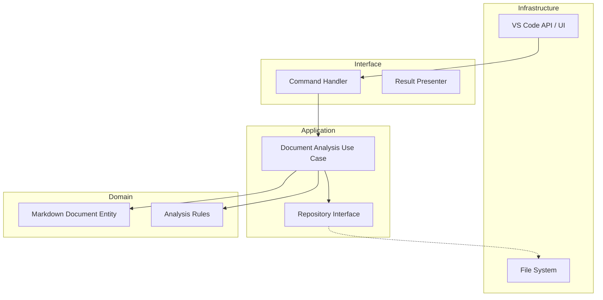

> [!IMPORTANT]
> このファイルは人間専用のリファレンスです。AIはこのファイルを読み込まず、必ず英語版マスターを参照してください。
> (This file is for human reference only. AI must not read this file and must refer to the English master.)

# Markdown Comment - AI コンテキスト & 開発ガイド

## プロジェクト概要

**Markdown Comment** は **Clean Architecture** で構築された VS Code 拡張機能です。Markdown ドキュメントに対する高度な分析およびリファクタリング機能を提供することを目的としています。データの永続化は堅牢な `.jsonl` ファイル (JSON Lines) を介して処理されます。

> [!IMPORTANT]
> **All AI responses and communication must be in Japanese.** (プロンプト応答、コミュニケーション、およびアーティファクト作成などの **全てのやり取りは日本語で行うこと** 。)

## アーキテクチャ

## クイックリファレンス

| タスク | コマンド |
| :--- | :--- |
| ビルド (Prod) | `npm run compile` (Webpack Production) |
| ビルド (Dev) | `npm run compile-dev` (Webpack Development) |
| 監視 (Watch) | `npm run watch` (Webpack Development) |
| リント (Lint) | `npm run lint` |
| ユニットテスト | `npm run test:unit` |
| 統合テスト | `npm run test:integration` |
| 全テスト | `npm test` |
| 拡張機能パッケージ化 | `npm run package` (VSCE) |

## 主要ディレクトリ

- `src/domain`: 純粋なビジネスロジックとエンティティ。
- `src/application`: ユースケースとインターフェース定義。
- `src/interface`: 外の世界とアプリケーションロジック間のアダプター。
- `src/infrastructure`: インターフェースの具体的な実装 (VS Code API, File System, Caching)。

## AI 向けオンボーディング

1. **境界の強制**: ロジックを追加するよう求められた場合、それが正しいレイヤーに入るようにしてください。
2. **TDD の遵守**: 常にテストが存在するか確認するか、最初に作成することを提案してください。
3. **ドキュメントポリシーの遵守**:
    - **英語がマスター**: 英語の `.md` ファイルのみを参照してください。
    - **ドキュメントの更新 (必須)**: コード変更を行う際は、常に対応するドキュメントを確認し更新してください。`README.md` と `GEMINI.md` が最新であることを確認してください。これはすべてのコード変更において厳格な要件です。
    - **日本語リファレンスの無視**: `.ja.md` ファイルは読まないでください。これらは人間用のリファレンス専用です。
4. **Markdown レンダリングエンジン**:
    - 2パスシステムを使用: (1) プレースホルダー MCSTART/END を Markdown に挿入, (2) `markdown-it` でレンダリング, (3) HTML を後処理してプレースホルダーを `<mark>` タグに置換。
    - 壊れたタグを防ぐため、`markdown-it` のカスタム `image` ルールで属性から偶発的なプレースホルダーを除去しています。
5. **同期ロジック**: プレビュー Webview は独自のサイドバー状態を管理します。インタラクションイベント (クリック/トグル) は `vscode.postMessage` を介して Webview と拡張機能間で同期されます。
6. **.cursorrules の確認**: このリポジトリの特定のコーディング規約が含まれています。

## エージェント設定 (`.agent/`)

`.agent` ディレクトリには AI アシスタントの設定が含まれています:

| ディレクトリ | 目的 |
| ----------- | --------- |
| `agents/` | サブエージェント定義 (planner, code-reviewer, doc-updater) |
| `commands/` | スラッシュコマンド (/plan, /code-review, /doc-sync) |
| `examples/` | 設定例 |
| `hooks/` | トリガーベースの自動化 (ドキュメント更新リマインダー) |
| `mcp-configs/` | MCP サーバー設定 |
| `plugins/` | プラグインメタデータ |
| `rules/` | 常時遵守ガイドライン |
| `scripts/` | ヘルパースクリプト |
| `skills/` | ドメイン専門知識定義 |
| `workflows/` | 開発ワークフロー |

> [!IMPORTANT]
> **フックによるドキュメント更新の強制**: コードが変更されると、フックが自動的にドキュメントの更新をリマインドします。
