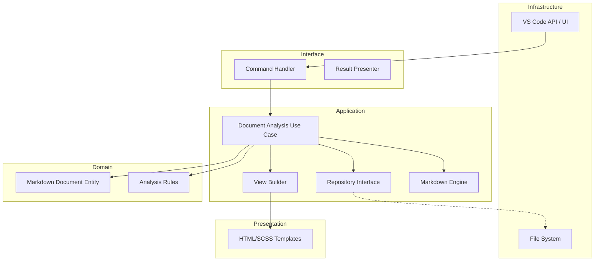

> [!IMPORTANT]
> このファイルは人間専用のリファレンスです。AIはこのファイルを読み込まず、必ず英語版マスターを参照してください。
> (This file is for human reference only. AI must not read this file and must refer to the English master.)

# Markdown Comment - AI コンテキスト & 開発ガイド

## プロジェクト概要

**Markdown Comment** は、**クリーンアーキテクチャ** で構築された VS Code 拡張機能です。Markdown ドキュメントに対する高度な分析およびリファクタリング機能を提供することを目的としています。データの永続化は、堅牢な `.jsonl` ファイル (JSON Lines) を通じて処理されます。

> [!IMPORTANT]
> **All AI responses and communication must be in Japanese.** (プロンプト応答、コミュニケーション、およびアーティファクト作成などの **全てのやり取りは日本語で行うこと** 。)

## アーキテクチャ

## クイックリファレンス

| タスク | コマンド |
| :--- | :--- |
| ビルド (本番) | `npm run compile` (Webpack Production) |
| ビルド (開発) | `npm run compile-dev` (Webpack Development) |
| ウォッチ | `npm run watch` (Webpack Development) |
| リント | `npm run lint` |
| ユニットテスト | `npm run test:unit` |
| 統合テスト | `npm run test:integration` |
| 全テスト | `npm test` |
| Electron E2E テスト | `npm run test:e2e -w packages/electron-app` |
| 拡張機能パッケージ化 | `npm run package` (VSCE) |
| リリース準備 | `npm run release:prepare` (or `scripts/prepare_release.sh`) |

## 主要ディレクトリ

- `src/domain`: 純粋なビジネスロジックとエンティティ。
- `src/application`: ユースケースとインターフェース定義。
- `src/views`: Webview 用の HTML テンプレートとスタイル。
- `src/interface`: 外部世界とアプリケーションロジック間のアダプター。
- `src/infrastructure`: インターフェースの具体的な実装 (VS Code API, ファイルシステム, キャッシュ)。

## AI 向けオンボーディング

1. **境界の強制**: ロジックを追加するよう求められた場合、正しいレイヤーに入るようにしてください。
2. **TDD の遵守**: テストが存在するかどうかを常に確認するか、最初にテストを作成することを提案してください。
3. **ドキュメントポリシーの遵守**:
    - **英語がマスター**: 英語の `.md` ファイルのみを参照してください。
    - **ドキュメントの更新 (必須)**: コード変更を行う際は、常に対応するドキュメントを確認し更新してください。`README.md` と `GEMINI.md` が最新であることを確認してください。これはすべてのコード変更に対する厳格な要件です。
    - **日本語参照の無視**: `.ja.md` ファイルは読まないでください。これらは人間用リファレンスのみです。
4. **Markdown レンダリングエンジン**:
    - レンダリングロジックをユースケースから分離するために `MarkdownEngine` クラスにカプセル化されています。
    - 2パスシステムを使用: (1) Markdown にプレースホルダー MCSTART/END を挿入, (2) `markdown-it` でレンダリング, (3) HTML を後処理してプレースホルダーを `<mark>` タグに置換。
    - `markdown-it` のカスタム `image` ルールにより、属性から偶発的なプレースホルダーを除去し、タグの破損を防ぎます。
    - **アンカー保護**:
        - ゼロ長コメントはポイントマーカー (`MCFIRST...MC` + `MCEND...MC`) としてレンダリングされます。
        - HTML タグや Markdown 構文 (リンク、画像) がコメントアンカーによって分割されないように保護されます。
        - **ヘッダー保護**: `markdown-it` のブロック解析を壊さないように、ヘッダー上のコメントアンカーはヘッダープレフィックスの末尾 (例: `# ` の後) に厳密にシフトされます。
5. **同期ロジック**: プレビュー Webview は独自のサイドバー状態を管理します。インタラクションイベント (クリック/トグル) は、`vscode.postMessage` を介して Webview と拡張機能間で同期されます。
    - Electron アプリの `renderer.js` は、`vscode.postMessage` ベースの状態同期をサポートするために VS Code API (`acquireVsCodeApi`) を模倣します。
    - **レイアウト永続化**: サイドバーの幅とパネルの高さは、`WindowManager` と `window-state.json` を介して永続化されます。
6. **アンカー設定と選択**:
    - **コンテキストマッチング**: プレビューの選択データに周辺テキスト (contextBefore/After) を含めることで、重複するテキストが存在する場合でも Markdown ソース内の正確なアンカー位置を特定できます。
7. **.cursorrules の確認**: このリポジトリの特定のコーディング標準が含まれています。
8. **E2E テスト戦略**:
    - `packages/electron-app/tests/utils/test_helper.ts` を使用して、Electron アプリの起動とコンソールキャプチャを一貫させます。
    - テストは Windows (ローカル) と Linux (DevContainer/CI) の両方の環境で合格する必要があります。
    - 失敗時のスクリーンショットは、サニタイズされたファイル名で `packages/electron-app/tests/` に保存されます。

## エージェント設定 (`.agent/`)

`.agent` ディレクトリには AI アシスタントの設定が含まれています：

| ディレクトリ | 目的 |
| ----------- | --------- |
| `agents/` | サブエージェント定義 (プランナー, コードレビュアー, ドキュメントアップデーター) |
| `commands/` | スラッシュコマンド (/plan, /code-review, /doc-sync) |
| `examples/` | 設定例 |
| `hooks/` | トリガーベースの自動化 (ドキュメント更新リマインダー) |
| `mcp-configs/` | MCP サーバー設定 |
| `plugins/` | プラグインメタデータ |
| `rules/` | 常に従うべきガイドライン |
| `scripts/` | ヘルパースクリプト |
| `skills/` | ドメイン専門知識の定義 |
| `workflows/` | 開発ワークフロー |

> [!IMPORTANT]
> **フックによるドキュメント更新の強制**: コードが変更されると、フックが自動的にドキュメントの更新をリマインドします。
