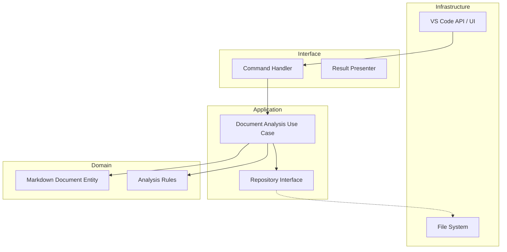

> [!IMPORTANT]
> このファイルは人間専用のリファレンスです。AIはこのファイルを読み込まず、必ず英語版マスターを参照してください。
> (This file is for human reference only. AI must not read this file and must refer to the English master.)

# Markdown Comment - AI 文脈 & 開発ガイド

## プロジェクト概要

**Markdown Comment** は、**クリーンアーキテクチャ**に基づいて構築された VS Code 拡張機能です。Markdown ドキュメントの高度な分析およびリファクタリング機能の提供を目指しています。データの永続化は、堅牢な `.jsonl` ファイル (JSON Lines) によって処理されます。

> [!IMPORTANT]
> **全ての AI プロンプト応答、コミュニケーション、およびアーティファクト作成は日本語で行うこと。**

## アーキテクチャ

## クイックリファレンス

| タスク | コマンド |
| :--- | :--- |
| ビルド | `npm run compile` |
| ウォッチ (自動ビルド) | `npm run watch` |
| リント | `npm run lint` |
| ユニットテスト | `npm run test:unit` |
| 統合テスト | `npm run test:integration` |
| 全テスト実行 | `npm test` |
| パッケージング | `npm run package` |

## 主要ディレクトリ

- `src/domain`: 純粋なビジネスロジックとエンティティ。
- `src/application`: ユースケースとインターフェース定義。
- `src/interface`: 外部世界とアプリケーションロジックの間のアダプター。
- `src/infrastructure`: インターフェースの具象実装 (VS Code API, ファイルシステム, キャッシュ等)。

## AI 向けオンボーディング

1. **境界の遵守**: ロジックを追加する際は、適切なレイヤーに配置されていることを確認してください。
2. **TDD の遂行**: 常にテストが存在するか確認し、存在しない場合はテストの作成をまず提案してください。
3. **ドキュメントポリシーの遵守**:
    - **英語が正本 (Master)**: 英語の `.md` ファイルのみを参照してください。
    - **ドキュメント更新 (必須)**: コードを変更した際は、必ず関連ドキュメントを点検・更新してください。`README.md` および `GEMINI.md` が最新であることを確認することは、全ての変更における厳格な要件です。
    - **日本語リファレンスの無視**: `.ja.md` ファイルはコンテキストとして読み込まず、人間用の参照としてのみ扱ってください。
4. **Markdown レンダリングエンジン**:
    - 2パス方式を採用しています: (1) Markdown 内にプレースホルダー MCSTART/END を挿入, (2) `markdown-it` でレンダリング, (3) HTML ポストプロセスでプレースホルダーを `<mark>` タグに置換。
    - `markdown-it` のカスタム `image` ルールにより、属性内に誤って入り込んだプレースホルダーを削除し、不正なタグの生成を防いでいます。
5. **同期ロジック**: プレビュー Webview は独自のサイドバー状態を管理します。インタラクションイベント (クリック/トグル) は、`vscode.postMessage` を介して Webview と拡張機能本体の間で同期されます。
6. **.cursorrules の確認**: このリポジトリ固有のコーディング規約が含まれています。

## エージェント設定 (`.agent/`)

`.agent` ディレクトリには、AI アシスタントの設定が含まれています：

| ディレクトリ | 用途 |
| ----------- | --------- |
| `agents/` | サブエージェント定義 (planner, code-reviewer, doc-updater) |
| `commands/` | スラッシュコマンド (/plan, /code-review, /doc-sync) |
| `examples/` | 設定例 |
| `hooks/` | トリガーベースの自動化 (ドキュメント更新リマインダー等) |
| `mcp-configs/` | MCP サーバー設定 |
| `plugins/` | プラグインメタデータ |
| `rules/` | 常に遵守すべきガイドライン |
| `scripts/` | ヘルパースクリプト |
| `skills/` | ドメイン知識定義 |
| `workflows/` | 開発ワークフロー |

> [!IMPORTANT]
> **フックによるドキュメント更新の強制**: コード変更時、フックによって自動的にドキュメント更新がリマインドされます。
