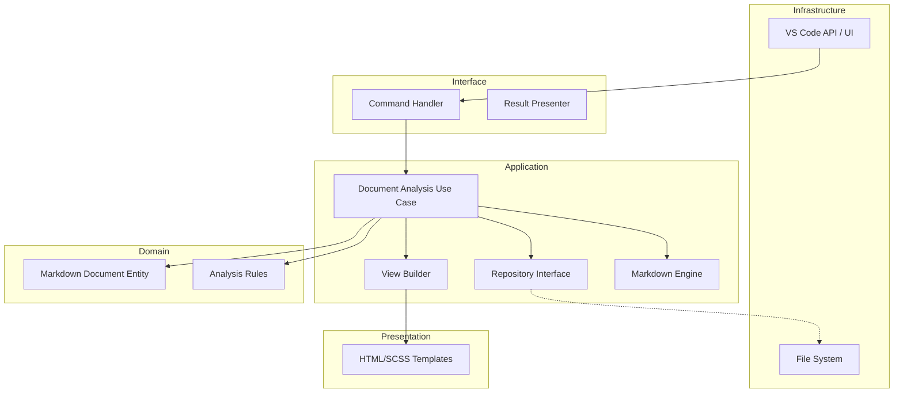

# Markdown Comment - AI Context & Development Guide

## Project Overview

**Markdown Comment** is a VS Code extension built with **Clean Architecture**. It aims to provide advanced analysis and refactoring features for Markdown documents. Data Persistence is handled via robust `.jsonl` files (JSON Lines).

> [!IMPORTANT]
> **All AI responses and communication must be in Japanese.** (プロンプト応答、コミュニケーション、およびアーティファクト作成などの **全てのやり取りは日本語で行うこと** 。)

## Architecture

## Quick Reference

| Task | Command |
| :--- | :--- |
| Build (Prod) | `npm run compile` (Webpack Production) |
| Build (Dev) | `npm run compile-dev` (Webpack Development) |
| Watch | `npm run watch` (Webpack Development) |
| Lint | `npm run lint` |
| Unit Tests | `npm test` (Runs all workspaces) |
| Integration Tests | `npm test` (Runs all workspaces) |
| All Tests | `npm test` |
| Electron E2E Tests | `npm run test:e2e -w packages/electron-app` |
| Package Extension | `npm run package` (VSCE) |
| Prepare Release | `npm run release:prepare` (or `scripts/prepare_release.sh`) |

## Key Directories

- `packages/core`: Core domain logic and application use cases.
    - `src/domain`: Pure business logic and entities.
    - `src/application`: Use cases and interface definitions.
    - `src/views`: HTML templates and logic for views.
- `packages/vscode-extension`: VS Code extension implementation.
    - `src/interface`: Adapters between Code API and application logic.
    - `src/infrastructure`: Concrete implementations (VS Code API, File System).
- `packages/electron-app`: Electron-based preview application.
    - `src/renderer`: React/Frontend code for the preview.
    - `src/main`: Electron main process code.

## Onboarding for AI

1. **Enforce Boundaries**: When asked to add logic, ensure it goes into the correct layer.
2. **Follow TDD**: Always check if tests exist or propose creating them first.
3. **Follow Documentation Policy**:
    - **English is Master**: Refer only to English `.md` files.
    - **Update Documentation (MANDATORY)**: Always review and update corresponding documentation when making code changes. Ensure `README.md` and `GEMINI.md` are up to date. This is a strict requirement for every code change.
    - **Ignore Japanese Reference**: Do NOT read `.ja.md` files; they are for human reference only.
4. **Worktree Management (MANDATORY)**:
    - **Worktree First**: AI agents MUST create a task-specific Git worktree inside the `.worktrees/` directory before starting any implementation.
    - **Absolute Paths**: All tool calls must use absolute paths targeting the worktree directory to ensure isolation and bypass workspace constraints.
5. **Markdown Rendering Engine**:
    - Encapsulated in `MarkdownEngine` class to separate rendering logic from use cases.
    - Uses a two-pass system: (1) Insert placeholders MCSTART/END into Markdown, (2) Render with `markdown-it`, (3) Post-process HTML to replace placeholders with `<mark>` tags.
    - Custom `image` rule in `markdown-it` strips accidental placeholders from attributes to prevent broken tags.
    - **Anchor Protection**: 
        - Zero-length comments are rendered as point markers (`MCFIRST...MC` + `MCEND...MC`).
        - HTML tags and Markdown syntax (link, image) are protected from being split by comment anchors.
        - **Header Protection**: Comment anchors on headers are strictly shifted to the end of the header prefix (e.g., after `# `) to prevent breaking `markdown-it` block parsing.
5. **Sync Logic**: The preview webview manages its own sidebar state. Interaction events (click/toggle) are synchronized between the webview and the extension via `vscode.postMessage`.
    - `renderer.ts` in Electron app mimics VS Code API (`acquireVsCodeApi`) to support `postMessage` based state synchronization. It is compiled as an ES Module to run in the browser environment.
    - **Layout Persistence**: Sidebar width and panel height are persisted via `WindowManager` and `window-state.json`.
6. **Anchoring & Selection**:
    - **Context Matching**: Selection data in the preview includes surrounding text (contextBefore/After) to ensure precise anchor placement in the Markdown source, even when duplicate text exists.
7. **Check .cursorrules**: It contains specific coding standards for this repo.
8. **E2E Testing Strategy**:
    - Use `packages/electron-app/tests/utils/test_helper.ts` for consistent Electron app launching and console capture.
    - Tests must pass in both Windows (local) and Linux (DevContainer/CI) environments.
    - Screenshots on failure are saved to `packages/electron-app/tests/` with sanitized filenames.

## Agent Configuration (`.agent/`)

The `.agent` directory contains AI assistant configurations:

| Directory | Purpose |
| ----------- | --------- |
| `agents/` | Subagent definitions (planner, code-reviewer, doc-updater) |
| `commands/` | Slash commands (/plan, /code-review, /doc-sync) |
| `examples/` | Configuration examples |
| `hooks/` | Trigger-based automations (doc update reminders) |
| `mcp-configs/` | MCP server configurations |
| `plugins/` | Plugin metadata |
| `rules/` | Always-follow guidelines |
| `scripts/` | Helper scripts |
| `skills/` | Domain expertise definitions (`chat-worktree`, `github_ops`, `issue_driven_development`, `markdown_expert`, `test_runner`) |
| `workflows/` | Development workflows |

> [!IMPORTANT]
> **Hooks enforce documentation updates**: When code changes, hooks automatically remind to update documentation.
