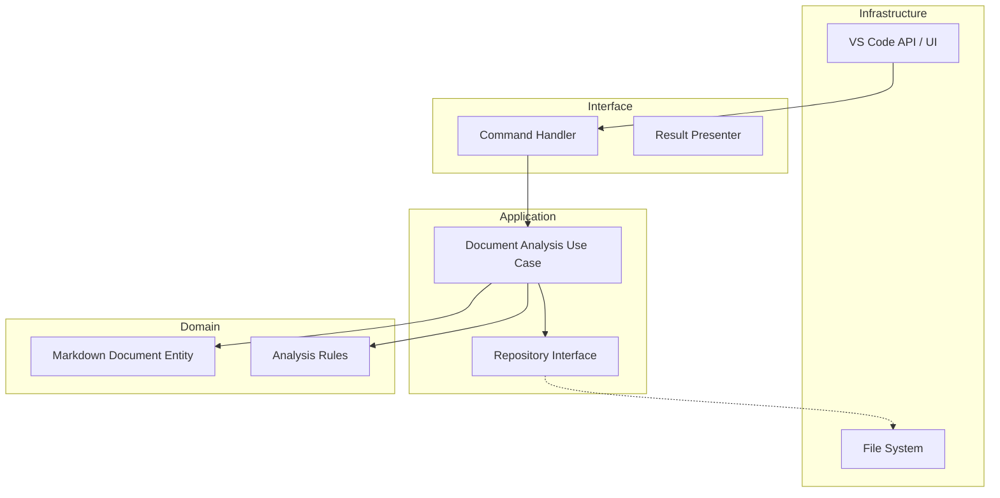

# Markdown Comment - AI Context & Development Guide

## Project Overview

**Markdown Comment** is a VS Code extension built with **Clean Architecture**. It aims to provide advanced analysis and refactoring features for Markdown documents. Data Persistence is handled via robust `.jsonl` files (JSON Lines).

> [!IMPORTANT]
> **All AI responses and communication must be in Japanese.** (全てのプロンプト応答とコミュニケーションは日本語で行うこと。)

## Architecture

## Quick Reference

| Task | Command |
| :--- | :--- |
| Build | `npm run compile` |
| Watch | `npm run watch` |
| Unit Tests | `npm run test:unit` |
| Integration Tests | `npm run test:integration` |
| All Tests | `npm test` |
| Package Extension | `npm run package` |

## Key Directories

- `src/domain`: Pure business logic and entities.
- `src/application`: Use cases and interface definitions.
- `src/interface`: Adapters between the outside world and application logic.
- `src/infrastructure`: Concrete implementations of interfaces (VS Code API, File System, Caching).

## Onboarding for AI

1. **Enforce Boundaries**: When asked to add logic, ensure it goes into the correct layer.
2. **Follow TDD**: Always check if tests exist or propose creating them first.
3. **Follow Documentation Policy**:
    - **English is Master**: Refer only to English `.md` files.
    - **Update Documentation (MANDATORY)**: Always review and update corresponding documentation when making code changes. Ensure `README.md` and `GEMINI.md` are up to date. This is a strict requirement for every code change.
    - **Ignore Japanese Reference**: Do NOT read `.ja.md` files; they are for human reference only.
4. **Check .cursorrules**: It contains specific coding standards for this repo.

## Agent Configuration (`.agent/`)

The `.agent` directory contains AI assistant configurations:

| Directory | Purpose |
|-----------|---------|
| `agents/` | Subagent definitions (planner, code-reviewer, doc-updater) |
| `commands/` | Slash commands (/plan, /code-review, /doc-sync) |
| `examples/` | Configuration examples |
| `hooks/` | Trigger-based automations (doc update reminders) |
| `mcp-configs/` | MCP server configurations |
| `plugins/` | Plugin metadata |
| `rules/` | Always-follow guidelines |
| `scripts/` | Helper scripts |
| `skills/` | Domain expertise definitions |
| `workflows/` | Development workflows |

> [!IMPORTANT]
> **Hooks enforce documentation updates**: When code changes, hooks automatically remind to update documentation.
