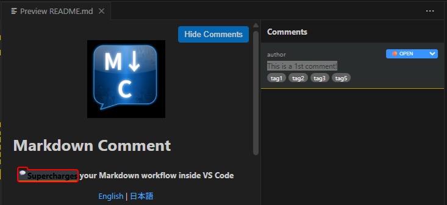
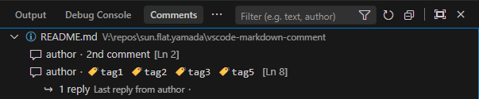

# Markdown Comment

**Supercharges your Markdown workflow inside VS Code**

[English](https://github.com/sun-flat-yamada/vscode-markdown-comment/blob/main/README.md) | [日本語](https://github.com/sun-flat-yamada/vscode-markdown-comment/blob/main/README.ja.md)

---

**Markdown Comment** provides PDF-like commenting and replying functionality for Markdown files. Best of all, it makes **no changes** to the Markdown file itself, keeping your content clean and pure.

While Markdown files are increasingly used for documentation and AI interactions, this extension smartly manages reviews and comments, bridging the gap between developers and non-technical stakeholders.

> [!NOTE]
> Comment data is persisted in a separate metadata file (your-md-file.meta.jsonl).
> For detailed file specifications, please refer to the following:
> [File Specification](./packages/vscode-extension/docs/meta-schema/README.md)

> [!NOTE]
> Future plans include browser extensions for viewers and editors to further expand accessibility.

## ✨ Key Features

- **Google Antigravity UI**: A complete modern visual overhaul for a premium user experience.
- **Markdown Preview Integration**: View comments directly within the native preview with rich highlighting.
- **Improved Highlighting**: Supports nested comment ranges and shows comment content on hover.
- **Sidebar Sync**: Seamlessly navigate between the preview highlights and the comment sidebar.
- **Robust Rendering**: Comment highlights no longer break image tags or other complex Markdown structures.
- **Dedicated Editor**: Edit Markdown with overlay comments.
- **Organization**: Tree and Table views for efficient comment management.
- **Open Recent**: Quickly access recently opened files from the main menu.

| Feature | Screenshot |
| :--- | :--- |
| Add Comment  |  |
| Preview  |  |
| Inline Editor |  |
| Tree Views |  |
| Table Views |  |
| Edit Tags |  |

## 🚀 Usage

1. **Open** a Markdown file (`.md`) in VS Code.
2. **Launch** the Command Palette (`Ctrl+Shift+P` / `Cmd+Shift+P`).
3. **Select** `Markdown Comment: Open preview to the Side`.
4. **Comment**: In the preview, select text, right-click, and choose `[Add Comment]`.
5. **Manage**: Click the "💬 Comments" button in the preview to open the sidebar. Click a comment in the sidebar to jump to the highlighted text, or click a highlight to reveal it in the sidebar.

## 💡 Commenting Highlights

- **Tagging**: Categorize comments with custom tags (manage via QuickPick).
- **Table Enhancements**: Resize columns, drag-and-drop to reorder, and click headers to sort comments.

- **Threading**: Post unlimited replies to create focused discussion threads.
- **Status Tracking**: Mark comments as Open, Resolved, etc., to track progress.
- **Rich Tooltips**: Hover over any highlighted text in the preview to see the original comment and its author instantly.
- **Synchronized View**: The preview highlights and the sidebar are fully synchronized, making it easy to track conversations across large documents.

## ⌨️ Commands

| Command | Title | Description |
| :--- | :--- | :--- |
| `markdown-comment.openPreview` | Open Preview | Opens the dedicated preview with comments. |
| `markdown-comment.openPreviewToSide` | Open Preview to the Side | Opens the preview to the side. |
| `markdown-comment.showCommentTable` | Show Comment Table | Opens the Comment Table view. |

## 🔧 Technical Details

- **Non-Invasive**: Comments are stored in a sidecar file (`filename.meta.jsonl`).
- **Clean Data**: Your original Markdown files remain untouched.

## ⚙️ Configuration

Customize the extension via VS Code Settings:

| Setting | Type | Default | Description |
| :--- | :--- | :--- | :--- |
| `markdownComment.commentsTable.columns` | `array` | `["lineNo", ...]` | Columns to display in the Comment Table (lineNo, content, status, etc.). |
| `markdownComment.commentsTable.columnWidths` | `object` | `{...}` | Pixel widths for table columns. |
| `markdownComment.defaultAuthor` | `string` | `""` | Default author name (defaults to system user if empty). |

## 🤝 Contribution & Support

Contributions are welcome! If you find this extension useful, please consider supporting its development.

## 📝 Release Notes

### 0.1.1 (Current)

- **UI Refresh**: Complete visual overhaul inspired by Google Antigravity style (Light mode base, pill shapes, Inter font).
- **Native Menu Integration**: Context menus in preview are now native for better OS integration.
- **Open Recent**: Added support for recently opened files in the main menu.
- **Layout Persistence**: Sidebar width and bottom panel height are now saved and restored.
- **Enhanced Anchoring**: Improved comment anchor precision using surrounding context matching.
- **Test Infrastructure**: Moved `.vscode-test` to `out` directory to keep workspace root clean.

### 0.1.0

### 0.0.7

- 1st release version

### 0.0.1 - 0.0.6

- DO NOT USE

### Dev Setup
- Node.js 20 or higher is required.
1. `npm install`
2. `npm run compile`
3. `npm run test:e2e -w packages/electron-app` (to run Electron E2E tests)
4. `F5` to debug

### Development with DevContainer
This repository supports DevContainers for a consistent development environment.
1. Install [Docker Desktop](https://www.docker.com/products/docker-desktop/) and [VS Code Dev Containers extension](https://marketplace.visualstudio.com/items?itemName=ms-vscode-remote.remote-containers).
2. Open the project in VS Code.
3. Run `Dev Containers: Reopen in Container`.
4. The environment includes Node.js and all dependencies for Electron/Playwright.
